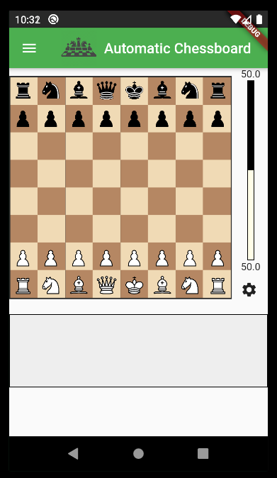
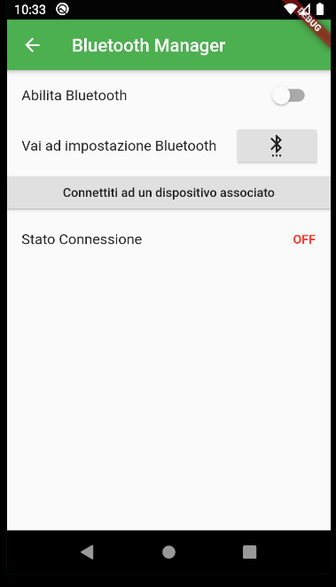

# ChessApp

This is the app that is part of the Automatic Chessboard project: https://github.com/giuseppemacc/Automatic-Chessboard

Allows you to decide the game mode and parameters.

  

* **Work in progress . . .**